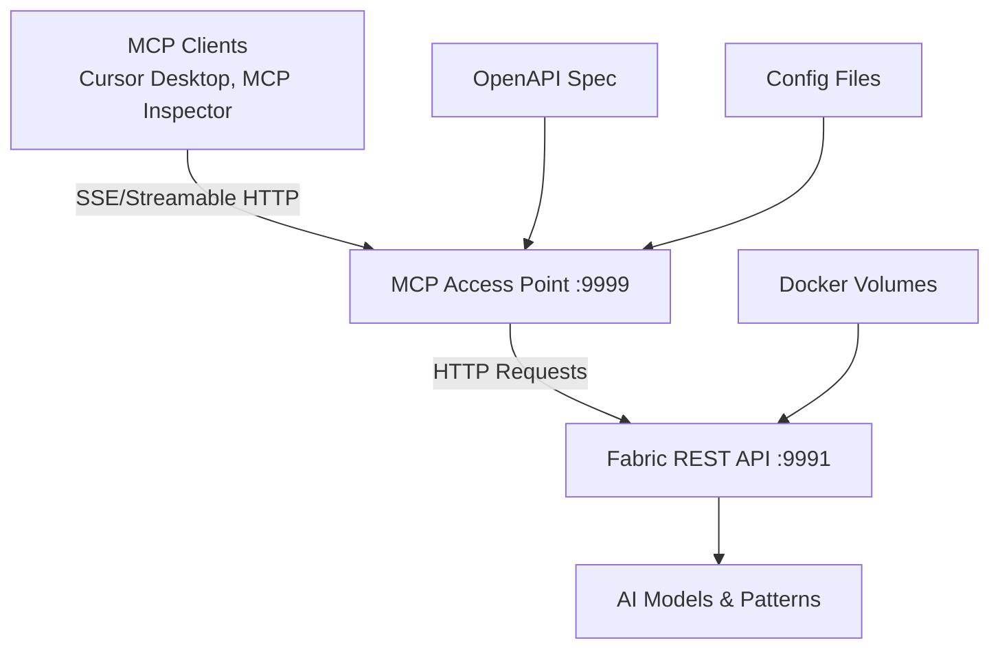

# MCP Proxy to API NoCode

A Docker Compose solution that exposes the [Fabric AI](https://github.com/danielmiessler/fabric) REST API through the [MCP Access Point](https://github.com/sxhxliang/mcp-access-point) protocol conversion gateway, enabling MCP clients like Cursor Desktop to interact with Fabric's AI pattern management capabilities.

## 🚀 Overview

This project provides a no-code solution for converting Fabric's REST API into MCP (Model Context Protocol) compatible services. It combines:

- **Fabric Main REST API**: The comprehensive AI pattern management system by Daniel Miessler
- **MCP Access Point**: A protocol conversion gateway that converts HTTP services to MCP services for MCP clients

## 🛠 Architecture



## 📦 Components

### Fabric Service
- **Port**: 9991 (mapped from internal 8080)
- **Purpose**: Core AI pattern management and LLM interaction
- **Features**:
  - Chat completions with various LLM providers
  - Pattern management (create, read, update, delete)
  - Session management for conversation history
  - Context management for additional data
  - Configuration management

### MCP Access Point
- **Port**: 9999 (mapped from internal 8080)
- **Purpose**: Protocol conversion gateway (HTTP → MCP)
- **Features**:
  - Converts HTTP services to MCP-compatible services
  - Supports SSE and Streamable HTTP protocols for MCP clients
  - Multi-tenancy support for multiple services
  - OpenAPI specification integration
  - Load balancing and routing capabilities

## 🔧 Configuration Files

### `config.yaml`
Main configuration for the MCP Access Point service:
- **MCP Services**: Defines services accessible via MCP protocol
- **Upstream Services**: Backend HTTP service configuration
- **Routing**: Maps MCP operations to HTTP endpoints
- **Headers**: Authentication and request header management

### `docker-compose.yaml`
Orchestrates both services with:
- **Service Dependencies**: Proper startup order and networking
- **Volume Mounts**: Persistent data storage for configurations and patterns
- **Environment Variables**: Secure API key management
- **Port Mappings**: External access configuration

### `config/fabric/openapi.json`
OpenAPI 3.0 specification defining Fabric's REST API endpoints that will be converted to MCP operations.

## 🚀 Quick Start

### Prerequisites
- Docker and Docker Compose installed
- API key for Fabric service

### Installation

1. **Clone the repository**:
   ```bash
   git clone https://github.com/limcheekin/mcp-proxy-to-api-nocode.git
   cd mcp-proxy-to-api-nocode
   ```

2. **Set your Fabric API key**:
   ```bash
   export FABRIC_API_KEY=your_actual_api_key_here
   ```
   
   Or edit the `docker-compose.yaml` file and replace `your_fabric_key_here` with your actual API key.

3. **Update the proxy configuration**:
   Edit `config.yaml` and replace `your_fabric_key_here` in the upstreams section:
   ```yaml
   upstreams:
     - id: 1
       headers:
         X-API-Key: "your_actual_api_key_here"
       nodes:
         "fabric:8080": 1
   ```

4. **Start the services**:
   ```bash
   docker-compose up -d
   ```

5. **Verify the deployment**:
   ```bash
   # Check service status
   docker-compose ps
   
   # Test with MCP Inspector
   npx @modelcontextprotocol/inspector
   # Connect to: http://localhost:9999/sse (SSE) or http://localhost:9999/mcp/ (Streamable HTTP)
   ```

## 📋 MCP Client Usage

### Supported MCP Clients
- **Cursor Desktop**: Configure MCP server with `http://localhost:9999/sse`
- **MCP Inspector**: Use for debugging and testing MCP operations

### Connection Endpoints
- **SSE Protocol**: `http://localhost:9999/sse`
- **Streamable HTTP**: `http://localhost:9999/mcp/`
- **Service-specific**: `http://localhost:9999/api/fabric/sse` or `http://localhost:9999/api/fabric/mcp/`

### MCP Operations Available
Based on the Fabric API, available MCP operations include:
- **Chat Operations**: Interact with AI models through chat completions
- **Pattern Management**: Create, read, update, and delete AI patterns
- **Session Management**: Manage conversation sessions
- **Context Management**: Handle additional context data

## 🔧 Configuration Examples

### Basic config.yaml Structure
```yaml
mcps:
  - id: fabric
    upstream_id: 1
    path: config/fabric/openapi.json

upstreams:
  - id: 1
    headers:
      X-API-Key: "your_fabric_api_key"
    nodes:
      "fabric:8080": 1
    scheme: http
```

### Multi-service Configuration
```yaml
mcps:
  - id: fabric-main
    upstream_id: 1
    path: config/fabric/openapi.json
  - id: fabric-patterns
    upstream_id: 1
    routes:
      - id: 1
        operation_id: list_patterns
        uri: /patterns/names
        method: GET
        meta:
          name: List Available Patterns
          description: Get all available AI patterns

upstreams:
  - id: 1
    headers:
      X-API-Key: "your_fabric_api_key"
    nodes:
      "fabric:8080": 1
    type: roundrobin
    scheme: http
```

## 🔒 Security

### API Key Authentication
Configure API keys in the upstreams section of `config.yaml`:
```yaml
upstreams:
  - id: 1
    headers:
      X-API-Key: "your_fabric_api_key"
      Authorization: "Bearer your_token"
```

### Network Security
- MCP clients connect via SSE or Streamable HTTP protocols
- Internal Docker networking for service communication
- Configurable headers for upstream authentication

## 📊 Monitoring and Debugging

### Using MCP Inspector
```bash
# Start MCP Inspector for debugging
npx @modelcontextprotocol/inspector

# Access at http://localhost:6274/
# Connect to your MCP Access Point:
# - SSE: http://localhost:9999/sse
# - Streamable HTTP: http://localhost:9999/mcp/
```

### Service Health Checks
```bash
# Check container status
docker-compose ps

# View logs
docker-compose logs fabric
docker-compose logs mcp-access-point

# Test direct Fabric API
curl http://localhost:9991/patterns/names -H "X-API-Key: your_api_key"
```

## 🐛 Troubleshooting

### Common Issues

1. **MCP Client Connection Failures**:
   - Verify MCP Access Point is running on port 9999
   - Check that the correct protocol endpoint is used (SSE vs Streamable HTTP)
   - Ensure OpenAPI specification is properly loaded

2. **Authentication Errors**:
   - Verify API keys are correctly configured in both services
   - Check that upstream headers are properly set in config.yaml

3. **Service Communication Issues**:
   - Ensure Fabric service is accessible from MCP Access Point
   - Verify Docker networking and port configurations

### Debug Commands
```bash
# Check MCP Access Point configuration
docker-compose exec mcp-access-point cat /app/config/config.yaml

# Test upstream connectivity
docker-compose exec mcp-access-point wget -O- http://fabric:8080/patterns/names

# Restart with fresh configuration
docker-compose down && docker-compose up -d
```

## 🤝 Contributing

1. Fork the repository
2. Create a feature branch: `git checkout -b feature/new-feature`
3. Commit your changes: `git commit -am 'Add new feature'`
4. Push to the branch: `git push origin feature/new-feature`
5. Submit a pull request

## 📝 License

This project is licensed under the MIT License - see the [LICENSE](LICENSE) file for details.

## 🙏 Acknowledgments

- [Daniel Miessler](https://github.com/danielmiessler) for the [Fabric](https://github.com/danielmiessler/fabric) project
- [sxhxliang](https://github.com/sxhxliang) for the [MCP Access Point](https://github.com/sxhxliang/mcp-access-point) protocol converter
- [Cloudflare](https://github.com/cloudflare) for the [Pingora](https://github.com/cloudflare/pingora) framework

## 📚 Additional Resources

- [Model Context Protocol Specification](https://spec.modelcontextprotocol.io/)
- [Fabric Documentation](https://github.com/danielmiessler/fabric)
- [MCP Access Point Documentation](https://github.com/sxhxliang/mcp-access-point)
- [Cursor MCP Integration Guide](https://docs.cursor.com/context/model-context-protocol)

---

**Note**: This setup converts Fabric's REST API into MCP-compatible services for use with MCP clients like Cursor Desktop. Replace API keys with your actual values before deployment.